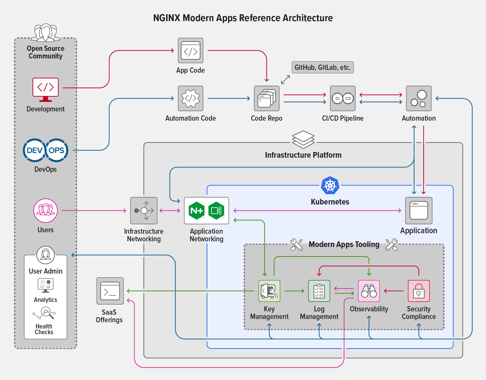

# NGINX Kubernetes Modern Reference Architecture
- Scalability, Portability, Resiliency, Agility

## Summary
You can either edit this `README.MD` for your convenience or add a Google Docs link. The summary will be helpful, because you can quickly read it before the interview.

- [Google Docs: XXXXXX](`Add a link if you created a doc using Google Docs`)
- Edit your summary.

## Modern App Architectures
We define modern app architectures as those driven by four characteristics: scalability, portability, resiliency, and agility. While many different aspects of a modern architecture exist, these are fundamental.

- **Scalability** – Quickly and seamlessly scale up or down to accommodate spikes or reductions in demand, anywhere in the world.

- **Portability** – Easy to deploy on multiple types of devices and infrastructures, on public clouds, and on premises.

- **Resiliency** – Can fail over to newly spun‑up clusters or virtual environments in different availability regions, clouds, or data centers.

- **Agility** – Ability to update through automated CI/CD pipelines with higher code velocity and more frequent code pushes.

To satisfy the four key characteristics, many modern app architectures employ:

- Platform agnosticism
- Prioritization of OSS
- Everything defined by code
- CI/CD automation
- Security-minded development
- Containerized builds
- Distributed storage

## Demo
- You can add simple source codes in the directory of `./demo` if you want to have real experience of this topic.

## Reference
- [GitHub: NGINX Modern Reference Architecture: Scalability, Portability, Resiliency, Agility](https://github.com/nginxinc/kic-reference-architectures)
